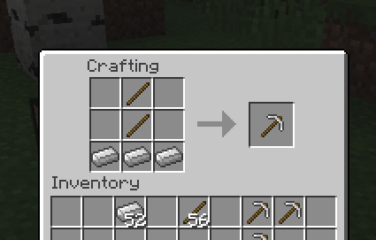

AustraliaCrafting
=================

Built for Spigot 1.8.3+ with Java 6+

This plugin turns all crafting recipes upside down



Commands
--------

`/flipcrafts`

When ran flips all the recipes (or flips them back). Saves value to 
config file to persist across reloads/restarts. 

Requires `uhc.flipcrafts` permission (defaults to OP)

Configuration
-------------

```yaml
flipped: true
skip update check: false
```

`flipped` - The default state to start the server in. Will be updated via the 
`flipcrafts` command

`skip update check` - set to true to stop checking/notifying for updates